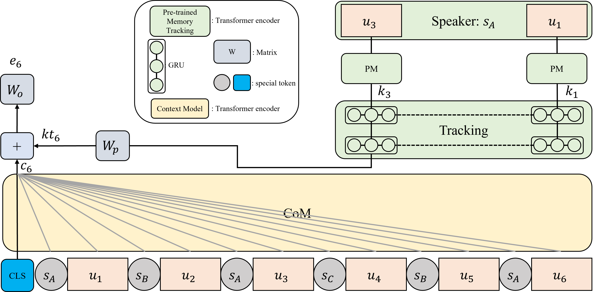

# CoMPM: Context Modeling with Speaker's Pre-trained Memory Tracking for Emotion Recognition in Conversation (NAACL 2022)

The overall flow of our model

## Requirements
1. Pytorch 1.8
2. Python 3.6
3. [Transformer 4.4.0](https://github.com/huggingface/transformers)
4. sklearn

## Datasets
Each data is split into train/dev/test in the [dataset folder](https://github.com/rungjoo/CoMPM/tree/master/dataset).
1. [IEMOCAP](https://sail.usc.edu/iemocap/iemocap_publication.htm)
2. [DailyDialog](http://yanran.li/dailydialog.html)
3. [MELD](https://github.com/declare-lab/MELD/)
4. [EmoryNLP](https://github.com/emorynlp/emotion-detection)

## Train
**For CoMPM, CoMPM(s), CoMPM(f)**

Argument
- pretrained: type of model (CoM and PM) (default: roberta-large)
- initial: initial weights of the model (pretrained or scratch) (default: pretrained)
- cls: label class (emotion or sentiment) (default: emotion)
- dataset: one of 4 dataset (dailydialog, EMORY, iemocap, MELD)
- sample: ratio of the number of the train dataset (default: 1.0)
- freeze: Whether to learn the PM or not

```bash
python3 train.py --initial {pretrained or scratch} --cls {emotion or sentiment} --dataset {dataset} {--freeze}
```

**For a combination of CoM and PM (based on different model)**

Argument
- context_type: type of CoM
- speaker_type: type of PM
```bash
cd CoMPM_diff
python3 train.py {--argument}
```

**For CoM or PM**
```bash
cd CoM or PM
python3 train.py {--argument}
```

## Testing with pretrained CoMPM
- [Google drive](https://drive.google.com/drive/folders/1VkKygJeI3Qb-kwxMMesFBl7I4uVqGMJF?usp=sharing)
- Unpack model.tar.gz and replace it in {dataset}_models/roberta-large/pretrained/no_freeze/{class}/{sampling}/model.bin
    - dataset: dailydialog, EMORY, iemocap, MELD
    - class: "emotion" or "sentiment"
    - sampling: 0.0 ~ 1.0, default: 1.0
    
```bash
python3 test.py
```
Test result for one seed. In the paper, the performance of CoMPM was reported as an average of three seeds.

| Model | Dataset (emotion) | Performace: one seed (paper) |
| :------: | :-------: | :-------: | 
| CoMPM | IEMOCAP | 66.33 (66.33) |
| CoMPM | DailyDialog | 52.46/60.41 (53.15/60.34) |
| CoMPM | MELD | 65.53 (66.52) |
| CoMPM | EmoryNLP | 38.56 (37.37) |

## Citation

```bibtex
@article{lee2021compm,
  title={CoMPM: Context Modeling with Speaker's Pre-trained Memory Tracking for Emotion Recognition in Conversation},
  author={Lee, Joosung and Lee, Wooin},
  journal={arXiv preprint arXiv:2108.11626},
  year={2021}
}
```